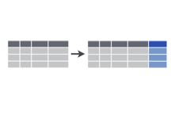
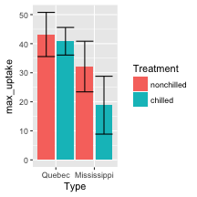

<style>
.reveal section code {
  font-size: 1em;
}
</style>

dplyr
========================================================
author: Etienne Low-Décarie
transition: fade

dplyr and plyr
===


Split-Apply-Combine
===

- Equivalent
  - SQL GROUP BY
  - Pivot Tables (Excel, SPSS, …)
  


***
  
- Split
  - Define a subset of your data
- Apply
  - Do anything to this subset 
    - calculation, modeling, simulations, plotting
- Combine

- Repeat this for all subsets
  - collect the results
  

History and use
===

- plyr
  - any input, any output
      - to load a list of files
      - to produce plots
  - slow and complicated

***

- dplyr
  - data.frame in/data.frame out
  - faster
  - Details:
   - introducing chaining to R
   - remote database integration
    
    
Conflict between plyr and dplyr
===

`plyr` and `dplyr` do not play nice together  
Always load `dplyr` last  
Be careful of packages that load `plyr` 


```r
require(plyr)
require(dplyr)
```

you can also use `dplyr:::` to ensure functions are called from dplyr  

[issue](https://github.com/hadley/dplyr/issues/347)

dplyr    
===

Vignette
[https://cran.rstudio.com/web/packages/dplyr/vignettes/introduction.html](https://cran.rstudio.com/web/packages/dplyr/vignettes/introduction.html)

Cheatsheet
[https://www.rstudio.com/wp-content/uploads/2015/02/data-wrangling-cheatsheet.pdf](https://www.rstudio.com/wp-content/uploads/2015/02/data-wrangling-cheatsheet.pdf)

Grouping
===

**Split** -Apply-Combine

- `group_by()`

Group data
===


```r
if(!require(dplyr)){install.packages("dplyr")}
require(dplyr)
CO2_by_Plant_Type_Treatment <- group_by(CO2,
                                        Plant,
                                        Type,
                                        Treatment)
```


group data
===

`group_by` implies `tbl_df`
`tbl_df` wraps a `data.frame`

```r
print(CO2_by_Plant_Type_Treatment)
```

```
Source: local data frame [84 x 5]
Groups: Plant, Type, Treatment [12]

   Plant   Type  Treatment  conc uptake
*  <ord> <fctr>     <fctr> <dbl>  <dbl>
1    Qn1 Quebec nonchilled    95   16.0
2    Qn1 Quebec nonchilled   175   30.4
3    Qn1 Quebec nonchilled   250   34.8
4    Qn1 Quebec nonchilled   350   37.2
5    Qn1 Quebec nonchilled   500   35.3
6    Qn1 Quebec nonchilled   675   39.2
7    Qn1 Quebec nonchilled  1000   39.7
8    Qn2 Quebec nonchilled    95   13.6
9    Qn2 Quebec nonchilled   175   27.3
10   Qn2 Quebec nonchilled   250   37.1
# ... with 74 more rows
```

```r
class(CO2_by_Plant_Type_Treatment)
```

```
[1] "grouped_df" "tbl_df"     "tbl"        "data.frame"
```

group data
===

**Caution when working with functions that expect a `data.frame`**


```r
class(CO2_by_Plant_Type_Treatment)
```

```
[1] "grouped_df" "tbl_df"     "tbl"        "data.frame"
```

```r
head(as.data.frame(CO2_by_Plant_Type_Treatment))
```

```
  Plant   Type  Treatment conc uptake
1   Qn1 Quebec nonchilled   95   16.0
2   Qn1 Quebec nonchilled  175   30.4
3   Qn1 Quebec nonchilled  250   34.8
4   Qn1 Quebec nonchilled  350   37.2
5   Qn1 Quebec nonchilled  500   35.3
6   Qn1 Quebec nonchilled  675   39.2
```


Apply verbes
===
class: small-code

Split-**Apply-Combine**

- `mutate`




- `summarise`


Summarize grouped data
===
class: small-code

Summarize by extracting maximum uptake per plant


```r
CO2_max_per_plant <- dplyr:::summarise(CO2_by_Plant_Type_Treatment,
                               max_uptake=max(uptake))
print(CO2_max_per_plant)
```

```
Source: local data frame [12 x 4]
Groups: Plant, Type [?]

   Plant        Type  Treatment max_uptake
   <ord>      <fctr>     <fctr>      <dbl>
1    Qn1      Quebec nonchilled       39.7
2    Qn2      Quebec nonchilled       44.3
3    Qn3      Quebec nonchilled       45.5
4    Qc1      Quebec    chilled       38.7
5    Qc3      Quebec    chilled       41.4
6    Qc2      Quebec    chilled       42.4
7    Mn3 Mississippi nonchilled       28.5
8    Mn2 Mississippi nonchilled       32.4
9    Mn1 Mississippi nonchilled       35.5
10   Mc2 Mississippi    chilled       14.4
11   Mc3 Mississippi    chilled       19.9
12   Mc1 Mississippi    chilled       22.2
```


Plot summarized data
===
left: 75%


 

```r
dodge <- position_dodge(1)

p <- ggplot(data=CO2_max_per_plant,
           aes(x=Type,
           y=max_uptake,
           fill=Treatment))+
           geom_bar(stat="summary",
           fun.y=mean,
           position=dodge)+
  stat_summary(fun.data="mean_cl_normal", 
               geom="errorbar",
               position=dodge)
```

***





Create a beautiful table of summarized data
===


```r
if(!require(gridExtra)){install.packages("gridExtra")}
require(gridExtra)
grid.newpage()
grid.table(head(data.frame(CO2_max_per_plant)))
```


Exercise 1
===

- Calculate the mean for each species value for each dimension of sepals and petals in the `iris` data set
- Produce an elegant table


<div class="centered">

<script src="countdown.js" type="text/javascript"></script>
<script type="application/javascript">
var myCountdown1 = new Countdown({
    							time: 300, 
									width:150, 
									height:80, 
									rangeHi:"minute"	// <- no comma on last item!
									});

</script>

</div>


dplyr mutate data
===

Calculate deviation from the mean uptake for each plant


```r
CO2_with_deviation <- mutate(CO2_by_Plant_Type_Treatment,
                               deviation_from_mean=uptake-mean(uptake))
```

Plot mutated data
===


```r
CO2.plot <- qplot(data = CO2_with_deviation,
                  x = conc,
                  y = deviation_from_mean,
                  colour = Treatment) + 
  facet_grid(.~Type)+
  geom_line(aes(group = Plant))
print(CO2.plot)
```


Writing your own functions
===

Calculate the slope and intercept for each plant


```r
intercept_slope <- function(conc, uptake){
  fit <- lm(uptake~conc)
  coefficients <- coef(fit)
  return(data.frame(intercept=coefficients[1],
                    slope=coefficients[2]))
}
```

note: there is now a better way to do this using require(broom)

Using your new function with dplyr
===


```r
CO2_fit <- summarise(CO2_by_Plant_Type_Treatment,
                     intercept=intercept_slope(conc, uptake)$intercept,
                     slope=intercept_slope(conc, uptake)$slope)
```

Plot the results of your new function
===
class: small-code


```r
dodge <- position_dodge(1)
p <- ggplot(data=CO2_fit,aes(x=Type,
           y=slope,
           fill=Treatment))+
           geom_bar(stat="summary",
           fun.y=mean,
           position=dodge)+
  stat_summary(fun.data="mean_cl_normal", 
               geom="errorbar",
               position=dodge)
```

***


Exercise 2
===

- Use the exercise_data_temp_par.csv file
- Calculate the deviations from the annual means  
- Calculate the annual absolute integrated anomaly


$$
\sum_{i=January}^{i=December}\left\lvert x_i- \bar x _{i2002-2014} \right\rvert
$$


Chaining operations
===


`%>%`  allows you to apply multiple functions sequentially  
(equivalent to "|" in bash)


```r
CO2_by_Plant_Type_Treatment <- group_by(CO2,
                                        Plant,
                                        Type,
                                        Treatment)
CO2_max_per_plant <- summarise(CO2_by_Plant_Type_Treatment,
                               max_uptake=max(uptake))
```

becomes


```r
CO2_max_per_plant <-CO2 %>%
                      group_by(Plant,
                                Type,
                                Treatment)  %>%
                      summarise(max_uptake=max(uptake)) 
```


Do
===

`do` is like `mutate` or `summarise`, but returns a list of any `R` objects


```r
CO2_fit <- CO2_by_Plant_Type_Treatment %>%
          do(model=lm(uptake~conc, data=.))
```


do and broom
===


```r
require(broom)
CO2_fit <- CO2_by_Plant_Type_Treatment %>%
          do(tidy(lm(uptake~conc, data=.)))
```

Exercise 3
===

- convert code from previous exercises (1 & 2) using `%>%` chaining
  -convert the `summarise` of the iris data set
  -convert the `mutate` of the monthly temperature


<div class="centered">

<script src="countdown.js" type="text/javascript"></script>
<script type="application/javascript">
var myCountdown1 = new Countdown({
    							time: 300, 
									width:150, 
									height:80, 
									rangeHi:"minute"	// <- no comma on last item!
									});

</script>

</div>


Split verbes
===

- `filter`

```r
filter(iris, Sepal.Width==3)
 
mtcars[iris$Sepal.Width == 3,]
```

- `select`

```r
select(iris, Species)
iris[,"Species"]
```


```r
select(iris, starts_with("Petal"))
```


dplyr database
===

https://cran.rstudio.com/web/packages/dplyr/vignettes/databases.html

create a database

```r
my_db <- src_sqlite("my_db.sqlite3", create = T)
```

dplyr database
===

load data into the database

```r
CO2_sqlite <- copy_to(my_db,
                      CO2, 
                      temporary = FALSE,
                      indexes = list("Plant",
                                     "Type",
                                     "Treatment",
                                     "conc",
                                     "uptake"))
```

dplyr database
===

use the tables from a database as a regular data.frame


```r
CO2_max_per_plant <-CO2_sqlite %>%
                      group_by(Plant,
                                Type,
                                Treatment)  %>%
                      summarise(max_uptake=max(uptake)) 
```

dplyr database
===

note that `dplyr` will only execute database calls when needed  
(when manipulated is being called eg. by `print()`)


plyr
===

- Load list of files
- Produce large number of complex plots


`do` for data exploration
===

Seperate string variable and spreading  (reminder)


```r
require(tidyr)

iris$specimen <- 1:nrow(iris)

long_iris<-gather(iris,"Measurement",
                  "Value",
                  Sepal.Length:Petal.Width)

seperated_iris <- separate(long_iris,
                      Measurement, 
                      c("Organ", "Dimension"))

wide_iris <- spread(seperated_iris,
                    Dimension,
                    Value)
```


`do` for data exploration
===


```r
list_plots <- wide_iris %>% group_by(Species) %>%
      do(print(qplot(data=.,
                    ymin=I(0),
                    ymax=Length,
                    xmin=I(0),
                    xmax=Width,
                    xlim=c(0,10),
                    ylim=c(0,10),
                    geom="rect",
                    facets=~specimen,
                    alpha=I(0.3),
                    fill=Organ)))
```

plyr
===

`_input_output_ply` functions:

`ddply`: data.frame in, data.frame out
can be done in dplyr

`ldply`: list in, data.frame out


plyr
===


```r
__ply(.data, 
      .variables,
      .fun = NULL,
      .progress = "text",
      .parallel = FALSE,
      .paropts = NULL)
```


`ldply` for file list loading
===

How to load and merge into a single data frame
all files in a directory


```r
file_list <- list.files("./Data/",
                        ".txt")

path_list <- paste0("./Data/",
                    file_list)

loaded_data <- ldply(.data=path_list,
                     function(x){
                       loaded_data <- read.csv(x)
                       loaded_data$path <- x
                       return(loaded_data)
                     }
```

Exercise 4
===

- load all files in `temperature_timeseries` using `ldply()`
- Calculate the annual absolute integrated anomaly for each site (`mutate`)
- Plot the annual absolute integrated anomaly for each site (`qplot`)

<div class="centered">

<script src="countdown.js" type="text/javascript"></script>
<script type="application/javascript">
var myCountdown1 = new Countdown({
    							time: 300, 
									width:150, 
									height:80, 
									rangeHi:"minute"	// <- no comma on last item!
									});

</script>

</div>


Feedback
===

[Feedback form](http://goo.gl/forms/3mH1UC0fH3)
http://goo.gl/forms/3mH1UC0fH3
